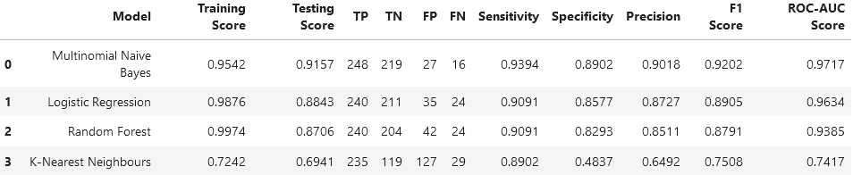
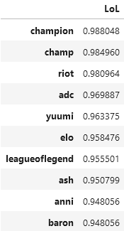
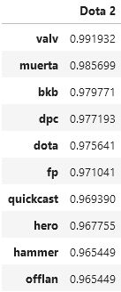
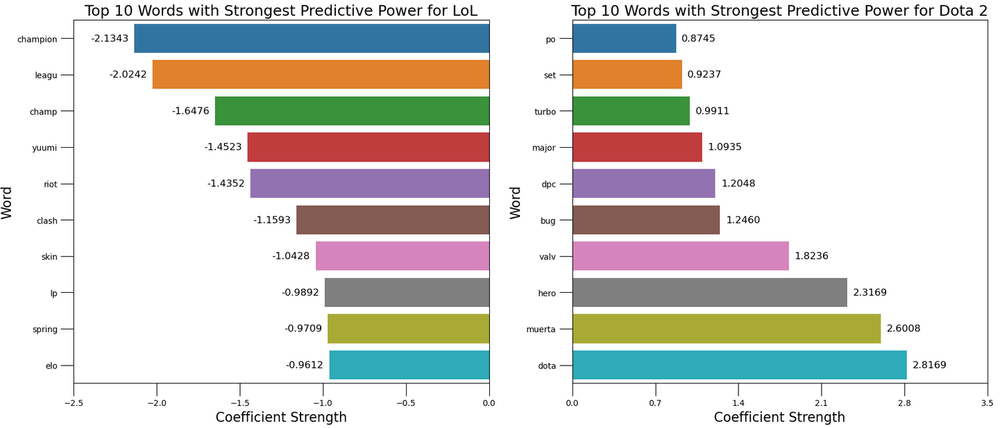
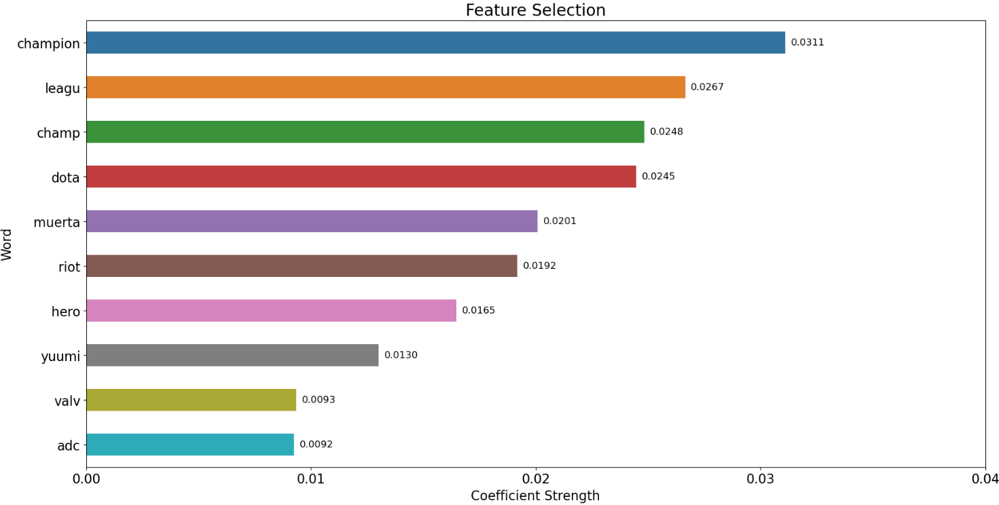

#   Project 3 - An Analysis of MOBA Games with NLP

**Primary Learning Objectives:**

1. Scrape posts from two subreddits
2. Use NLP to train a classifier to predict which subreddit a given post comes from

## Background

Dota 2 and League of Legends (LoL) are highly popular Multiplayer Online Battle Arena (MOBA) games, which involve 2 teams to compete against each other in a predefined battlefield to achieve a common objective. Dota 2 and LoL are owned by different companies (Valve Corporation and Riot Games respectively), hence are considered to be direct competitors in the MOBA market. As of 2023, it appears that [League of Legends is more popular than Dota 2](https://gamesight.io/leaderboards/moba-games) as the former has consistently recorded a higher amount of viewership hours and number of streamers. 

In this project, I am assuming the role of a business analyst from Valve Corporation, tasked to assist the game design team working on MOBA games. One of my core KPIs is to maximise the player base for Dota 2. My target audience for this project includes both existing and new MOBA gamers, and my goal is to find out what interests them by identifying relevant keywords that appeal to them.

As there is an active Reddit community each for Dota 2 and LoL, I will explore posts from both subreddits and use natural language processing to examine if there are any keywords that can help to predict whether a post belongs to Dota 2 or LoL subreddit, and sieve out features that could possibly explain why LoL is more popular than Dota 2.

---
## Problem Statement

What can we learn from Dota 2 and LoL posts to attract existing and new gamers to play Dota 2? Through our binary classifier, we hope to answer this question by uncovering certain text that is unique to Dota 2 and/or LoL that can help us to generate actionable insights. 

---
## Dataset

Webscraping was performed on both [Dota 2](https://www.reddit.com/r/DotA2/) and [LoL](https://www.reddit.com/r/leagueoflegends/) subreddits. Approximately 2000 posts combined from both subreddits were retrieved for further text analysis and can be found in the `dataset` folder.

---
## Technical Report

The technical report is split into 4 parts in the `code` folder. 

---
## Findings
For this problem statement, we will aim to maximise the correct classification of posts, and use accuracy as the classification metric. This is because our dataset is relatively well-balanced between the 2 different subreddits, and there is no clear decision to minimise either false positives or false negatives as well. The performance summary of various models is as shown below.
 

Using Multinomial Naive Bayes, we were able to pinpoint the keywords that were very likely to identiy a subreddit type immediately.
 

From Logistic Regression, we sorted different words based on their coefficients as their magnitude reflected the predictive capability of a subreddit type.
 

No additional unique words were found from Random Forest, results were consistent with the 2 models above after validating the top few words with highest feature importance.
 

---
## Conclusion & Recommendations
From above discussion regarding various model insights, we can propose a few actions to capture the interest of the gaming community. With the results from Naive Bayes, it might be worth revisting the matchmaking rating (MMR) system in Dota 2 to calibrate the skill levels amongst the player base and also pay more attention to the concerns of gamers that experience FPS issues, which might be related to the game client itself. With the results from Logistic Regression, we can also introduce rewards to engage the gaming community to help out with bug testing and further improve the gameplay experience, such as the design of cosmetics (otherwise known as skins) or other gaming features (eg. voicelines, stickers etc).

---
## Future Work
On top of current findings, there are several things that can be examined to further improve our models. As Dota 2 and LoL are unlikely to stop running anytime soon due to their popularity in the MOBA market, periodic text data collection can be done. We would foresee new text appearing as new game changes come along eventually. Further stopword optimization can be done as well to check for model accuracy improvement, this would likely be the elimination of words that occur repeatedly in both Dota 2 and LoL posts as prior data cleaning has been done to eliminate unwanted noise (eg. web URLs containing http and newline denoted by \n). Lastly, more pipeline transformers and classifiers can be explored with their respective hyperparameter optimization.
