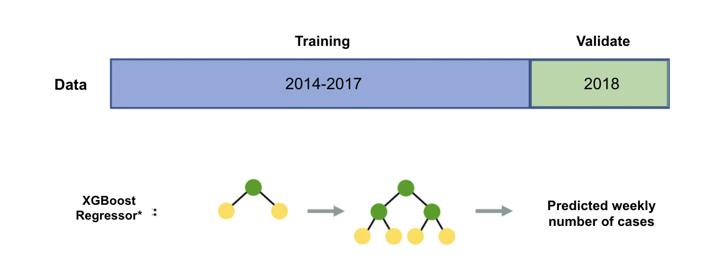
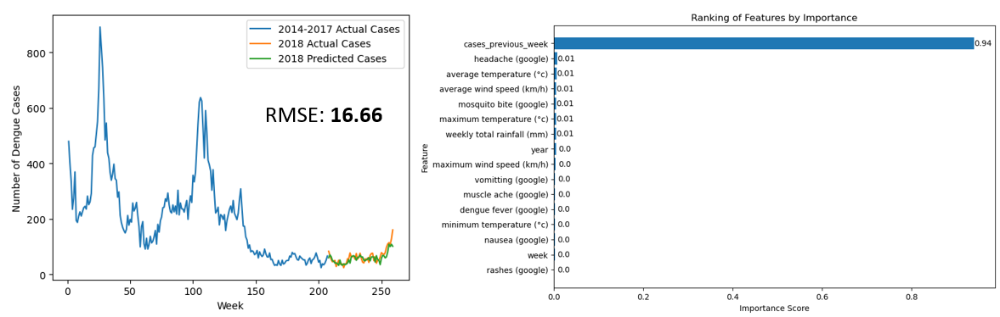

#  Project 4: Singapore Dengue Cases Prediction

## Table of Contents
- [Background](#Background)  
- [Problem Statement](#Problem-Statement) 
- [Dataset](#Dataset)
- [Executive Summary](#Executive-Summary)
- [Conclusions and Recommendations](#Conclusions-and-Recommendations)  
- [Project Planning Documentation](#Project-Planning-Documentation)  

## Background
Dengue fever is a viral infection that spreads from the Aedes mosquito to people and is commonly found in tropical countries, including Singapore. The average lifespan of an Aedes mosquito is approximately 2 weeks and it takes approximately 8-10 days for an egg to evolve into an adult. A mosquito can lay eggs about three times in its lifetime, and about 100 eggs are produced each time. This increases the risk of dengue transmission due to the short time required for mosquitoes to breed and populate. Most people recover from dengue fever within a week or so. However in some cases, symptoms worsen and can become life-threatening. Since there is no specific treatment for dengue/severe dengue, therefore it is imperative to have preventive measures in place. These include vector control, detection/monitoring systems and medical care.

[Return to top](#Table-of-Contents)  

## Problem Statement
The goal of this project is to predict the number of dengue cases in Singapore on a temporal and spatial level, to enable targeted intervention and better resource allocation. 

[Return to top](#Table-of-Contents)  

## Dataset
We curated the dataset from:
1. [Historical daily weather](http://www.weather.gov.sg/climate-historical-daily/): Daily weather data includes rainfall, temperature and wind speed in Singapore
2. [Weekly dengue cases](https://data.gov.sg/dataset/weekly-number-of-dengue-and-dengue-haemorrhagic-fever-cases): Weekly number of dengue cases from 2014 to 2018 in Singapore
3. [Google trends](https://trends.google.com/trends/explore?date=today%205-y&geo=SG&q=%2Fm%2F09wsg): Google search terms containing ‘dengue’ in Singapore
4. [Dengue clusters](http://outbreak.sgcharts.com/data): Dengue cluster records in Singapore used for this project from 2015 to 2018
5. [Master Plan Subzone Boundary (No Sea)](https://data.gov.sg/dataset/master-plan-2014-subzone-boundary-no-sea?resource_id=c30bfcc0-7e23-4959-b4d9-c5da5e00af54): A shapefile that contained the geographic information of all 323 subzones in Singapore

[Return to top](#Table-of-Contents)

## Executive Summary

### Exploratory Data Analysis (EDA)

We first compared the weekly trend of google search terms against the number of dengue cases from 2014 to 2018, to identify potential predictors we can use in our model. In particular, we found that the google search trend for "dengue fever" followed quite closely to the dengue cases trend, with similar peaks occurring in 2014 and 2016. Hence, the search for "dengue fever" could be a strong predictor for number of dengues cases.

We also compared the weather data trend such as rainfall and wind speed against the number of dengue cases, as mosquitos require stagnant water to breed. However, we found that the weather data did not seem to correlate with the number of dengue cases. Thus, we expect that weather data may not be useful in predicting number of dengue cases.

To visualize the spatial distribution of infecting locations in Singapore from 2015 to 2018, we plotted all infecting locations involved in the dengue clusters during this period and mapped them to the corresponding subzones. The resulting map is color-coded with the cumulative case numbers, revealing that the top 10 infecting subzones were mainly concentrated in the east, north-east, north, and central regions.

To investigate the potential correlation between weather patterns and dengue cases, we mapped the average weekly total rainfall, weekly mean temperature and weekly mean wind speed with the spatial distribution of infecting locations. However, due to the unavailability of data for all subzones, it is challenging to establish a clear relationship between weather patterns and dengue cases in each subzone.

### Modeling

XGBoost regressor was selected as the model used to predict overall weekly number of dengue cases over time. We split our data such that 2014-2017 data was used for training, while 2018 data was used for validation of our model performance. The Root Mean Squared Error (RMSE) was calculated for validation set and used to compare against the baseline models (annual mean/median).

Our initial model returned a RMSE of 45.58, with the google search of "dengue fever" showing a strong impact in the prediction. However, when retraining our model with lagged features, we found that the number of dengue cases in the previous week became the dominant feature, with RMSE improving to 16.66. This suggests a strong autoregression present in the data, which we took tried to account for in our spatial level modeling.

The forecasting algorithm used processed data on dengue clusters with subzones during the geospatial EDA phase. LightGBM regressor was selected as the prediction model, and the data were split into training (80%) and testing (20%) sets for out-of-sample validation based on the time period. Within the training set, 30% of the data was further partitioned as the validation set during training. The Symmetric Mean Absolute Percentage Error (SMAPE) was calculated and compared for the prediction and baseline (lag1) using the validation set during training.

The model will be used to predict on a weekly basis: starting with the first week of the test set, the model predicts the number of dengue cases for each subzone, then when it came to the second week, the true value of the past week should be already known and it will be used to predict the number of cases for the second week, and so on until the entire test set has been predicted. To evaluate the accuracy of the model, we selected the first and second weeks of test set and compared the predicted values to the true values for geographic analysis.

The training results demonstrated an average SMAPE of 33.2% for the first week prediction, which was lower than the baseline (lag1) 35.2%. Upon comparing the geographic distribution of our predictions with the true values, we noticed that our predictions identified the same hotspot zones as the true values. The second week prediction had similar results, indicating the stability of the model. However, based on the SMAPE of the full validation set (45 weeks) during training, we observed that certain weeks had a significantly large prediction error (up to 74%). This indicates that the model with autoregression alone may not be sufficient for long-term predictions. Additional data with more features that can better describe the target variable are required to improve the model's accuracy and reduce its variance.

### Cost-Benefit Analysis
- **Targeted intervention**: With 323 subzones in Singapore, assume the cost of intervention in each subzone would be 10,000 SGD. By predicting the number of dengue cases at the subzone level, it becomes possible to identify the top 10 subzones that are at the highest risk of dengue transmission. Targeting these subzones with intervention measures can prevent the majority of dengue cases and reduce the overall cost of intervention to 100,000 SGD (10 subzones x 10,000 SGD per subzone), instead of 3,230,000 SGD (323 subzones x 10,000 SGD per subzone) if intervention measures were applied uniformly.

- **Resource allocation**: Each subzone in Singapore has an average population of 15,900 (calculated by dividing 5 million by 315 residential subzones), and limited medical personnel and supplies can be a challenge in combating dengue, particularly during periods of strain on healthcare resources, such as the COVID-19 pandemic. By predicting the number of dengue cases at the subzone level, it becomes possible to allocate resources efficiently. If a particular subzone is predicted to have a high number of dengue cases, resources such as medical personnel, mosquito control measures, and other supplies can be allocated to that subzone. For instance, if a subzone is predicted to have 50 cases, it may require 10 medical personnel to treat patients, 15 mosquito control workers to eliminate breeding sites, and additional supplies such as mosquito nets and repellent. In contrast, if another subzone is predicted to have only 5 cases, it may require significantly fewer resources to combat the disease.
    
[Return to top](#Table-of-Contents)

## Conclusions and Recommendations 
By predicting the number of dengue cases at a subzone level, we are able to put appropriate measures in place to minimize the risk of a dengue outbreak. Targeting specific subzones is cost-efficient and also provides a timely reaction by prioritizing the actions required for dengue hotspots. Singapore's healthcare system should be able to respond to any medical outbreak, however care should be taken not to stretch its relatively limited resources. From NEA's perspective, we would suggest looking into redistributing its Gravitraps to assess impact of dengue case reduction, as well as working towards a self-sustaining supply of Wolbachia mosquitoes to help limit the population of the Aedes species.

[Return to top](#Table-of-Contents)  

## Project Planning Documentation

| Deliverables | Task Owner | Need Date |
| :-: | :-: | :-: |
| Webscraping | Song Kai | 2 April 2022 |
| Data cleaning | Song Kai, Juliana | 7 April 2022 |
| EDA | Juliana, Hong Xiang | 14 April 2022 |
| Temporal modelling | Hong Xiang, Song Kai | 20 April 2022 |
| Geospatial modelling | Juliana | 24 April 2022 |
| Cost Benefit Analysis | Juliana, Hong Xiang, Song Kai | 26 April 2022 |
| Project Report | Juliana, Hong Xiang, Song Kai | 28 April 2022 |
| Presentation Slides | Juliana, Hong Xiang, Song Kai | 28 April 2022 |

[Return to top](#Table-of-Contents)